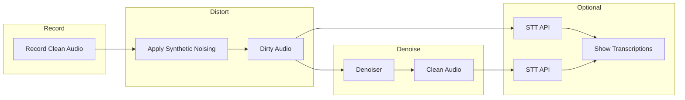
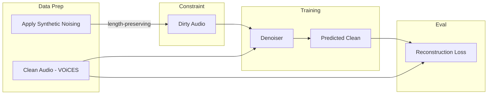

# Relay Walkie-Talkie Denoiser — Master Plan

## Scope

**In-scope:** Build a denoiser that maps dirty (cellular-degraded) audio to clean audio. Train on VOiCES with a small U-Net on spectrograms. Demo: spectrograms, before/after playback, optional transcription comparison via external STT API.

**Out-of-scope:** Building or training STT. We consume an STT API (Whisper API, Deepgram, AssemblyAI) only to complete the demo dataflow.

---

## Project Context

- **Event:** Relay ML Engineering onsite — Monday, March 9, 2026, 2:00 PM ET, Raleigh, NC
- **Company:** Relay (relaypro.com) — frontline communication platform (hospitality, manufacturing, healthcare)
- **Business value:** Voice degrades through codec/radio/network; denoising improves transcription, translation, searchability

---

## Data Flows

### Inference / Demo




1. Record or load clean audio
2. Apply synthetic distortions → dirty audio
3. Denoiser → clean audio
4. (Optional) STT API on noisy vs. clean → transcription comparison

### Training




- VOiCES clean audio → synthetic noising (length-preserving) → dirty/clean pairs
- Train U-Net to map dirty → clean; evaluate with MSE or L1 on spectrogram

---

## Synthetic Noising Pipeline

Simulate cellular voice stack (VoLTE/VoNR): codecs, narrowband, packet loss, environmental noise. All transforms must be length-preserving.


| Transform                  | Purpose                           | Length-preserving |
| -------------------------- | --------------------------------- | ----------------- |
| Bandpass 300Hz–3.4kHz      | AMR-NB bandwidth                  | Yes               |
| Resample 8kHz (round-trip) | AMR sample rate                   | Yes               |
| FFmpeg AMR round-trip      | CELP artifacts, 4.75–12.2 kbps    | Yes               |
| Packet loss simulation     | PLC-style frame replacement       | Yes               |
| Environmental noise        | Additive white/pink, variable SNR | Yes               |


Use FFmpeg `libopencore-amrnb` for real codec round-trip.

---

## Data

**Dataset: VOiCES only** — [iqtlabs.github.io/voices](https://iqtlabs.github.io/voices/downloads/)

- Download: `aws s3 cp s3://lab41openaudiocorpus/VOiCES_devkit.tar.gz .` (or full release)
- Creative Commons; acoustically challenging; paired clean/noisy for denoising

---

## Building the Denoiser

### Domain

- **Spectrogram:** mel/STFT in → model → clean spectrogram out → inverse STFT to waveform
- Skip waveform end-to-end (more data/params)

### Architecture: Small U-Net

- **Input:** `[B, 1, F, T]` (noisy spectrogram)
- **Encoder:** 3–4 stages; Conv2d → BN → ReLU → MaxPool; halve H,W, double channels (32 → 64 → 128 → 256)
- **Bottleneck:** Conv blocks, no downsampling
- **Decoder:** UpConv → concat skip → Conv2d → BN → ReLU; double H,W, halve channels
- **Output:** `[B, 1, F, T]` (clean spectrogram)

Design: base channels 32 or 64; skip connections from encoder; output ReLU or none (spectrograms ≥ 0).

### Data Flow

1. Preprocess: waveform → STFT/mel → log-magnitude (optional) → normalize
2. Model: `pred_clean_spec = denoiser(noisy_spec)`
3. Postprocess: predicted magnitude + noisy phase → inverse STFT → waveform

### Loss and Training

- **Loss:** MSE or L1 on spectrogram
- **Training:** Standard loop; Adam/AdamW, lr ~1e-3 with decay
- **Checkpointing:** Full model

### Implementation Components

- `Denoiser` — encoder, bottleneck, decoder, skip connections
- `EncoderBlock` / `DecoderBlock` — Conv + BN + ReLU; encoder returns pre-pool for skip
- `SpectrogramTransform` — waveform ↔ spectrogram (torchaudio)
- `DenoisePipeline` — inference wrapper: waveform → spec → model → spec → waveform

---

## Requirements

- PyTorch; FFmpeg with libopencore-amr
- Deployable demo: feed audio, show/hear denoised output
- Spectrograms: clean vs. noisy vs. denoised
- Audio playback (before/after)
- STT via external API
- Small U-Net trainable in hours

---

## Implementation Structure

```
relay-walkie-denoising/
├── README.md
├── requirements.txt
├── config/defaults.yaml
├── data/
│   ├── download_voices.py
│   ├── synthetic_noise.py
│   └── dataset.py
├── models/
│   ├── denoiser.py
│   └── losses.py
├── train.py
├── inference.py
├── demo/
│   ├── app.py
│   ├── spectrogram_viz.py
│   ├── audio_player.py
│   └── stt_client.py
└── scripts/demo_sample_audio.py
```

---

## Future Considerations

- **Non-ML baseline:** Explore spectral subtraction, Wiener, RNNoise-style hybrid to gauge when ML is justified. Pure DSP often struggles with codec artifacts and complex noise.

---

## Next Steps

1. Scaffold project and dependencies
2. Download VOiCES; implement cellular noising pipeline (length-preserving)
3. PyTorch Dataset and data loader (paired clean/dirty)
4. Implement U-Net denoiser; train with MSE or L1
5. Build demo: spectrograms, playback, optional STT API integration
6. Sample scripts and README

