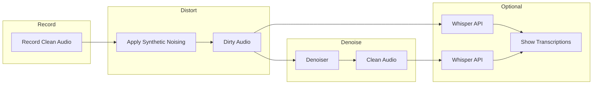
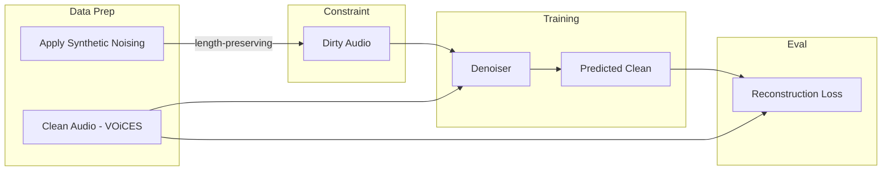

# Relay Walkie-Talkie Denoiser — Master Plan

## Scope

**In-scope:** Build a denoiser that maps dirty (cellular-degraded) audio to clean audio. Train on VOiCES with a small U-Net on spectrograms. Demo: spectrograms, before/after playback, optional transcription comparison via Whisper API.

**Out-of-scope:** Building or training STT. We use the **Whisper API** (OpenAI) for transcription.

---

## Project Context

- **Event:** Relay ML Engineering onsite — Monday, March 9, 2026, 2:00 PM ET, Raleigh, NC
- **Company:** Relay (relaypro.com) — frontline communication platform (hospitality, manufacturing, healthcare)
- **Business value:** Voice degrades through codec/radio/network; denoising improves transcription, translation, searchability

---

## Data Flows

### Inference / Demo




1. Record or load clean audio
2. Apply synthetic distortions → dirty audio
3. Denoiser → clean audio
4. (Optional) Whisper API on noisy vs. clean → transcription comparison

### Training




- VOiCES clean audio → synthetic noising (length-preserving) → dirty/clean pairs
- Train U-Net to map dirty → clean; evaluate with MSE or L1 on spectrogram

### Training Environment: Google Colab

The VOiCES devkit is too large for typical local machines. **Training runs in Google Colab** (GPU runtime). All model development and evaluation code lives in a single **Jupyter notebook** designed to run top-to-bottom in Colab. The notebook produces the checkpoint, training metrics, and eval results needed for the demo.

---

### Independent Denoiser Evaluation

Evaluate the denoiser directly (no STT) on the devkit test set: compare output to clean reference. Include a **non-ML baseline** via `noisereduce` for comparison.

**Baseline: noisereduce** — spectral gating / subtractive denoising; no training. Run same eval: noisy → `noisereduce.reduce_noise()` → baseline output. Compute same metrics (SI-SDR, PESQ, MSE) and WER for baseline vs. our U-Net denoiser.


| Metric       | What it measures                                       |
| ------------ | ------------------------------------------------------ |
| **SI-SDR**   | Signal fidelity; higher = better reconstruction        |
| **PESQ**     | Perceptual quality (optional; requires `pesq` package) |
| **MSE / L1** | Spectrogram or waveform reconstruction error           |


**Comparison:** noisy (no processing), noisereduce baseline, U-Net denoiser — all vs. clean reference. Report in demo to show when ML outperforms traditional DSP.

---

## Synthetic Noising Pipeline

Simulate cellular voice stack (VoLTE/VoNR): codecs, narrowband, packet loss, environmental noise. All transforms must be length-preserving.


| Transform                  | Purpose                           | Length-preserving |
| -------------------------- | --------------------------------- | ----------------- |
| Bandpass 300Hz–3.4kHz      | AMR-NB bandwidth                  | Yes               |
| Resample 8kHz (round-trip) | AMR sample rate                   | Yes               |
| FFmpeg AMR round-trip      | CELP artifacts, 4.75–12.2 kbps    | Yes               |
| Packet loss simulation     | PLC-style frame replacement       | Yes               |
| Environmental noise        | Additive white/pink, variable SNR | Yes               |


Use FFmpeg `libopencore-amrnb` for real codec round-trip.

---

## Data

**Dataset: VOiCES only** — [iqtlabs.github.io/voices](https://iqtlabs.github.io/voices/downloads/)

- Download: `aws s3 cp s3://lab41openaudiocorpus/VOiCES_devkit.tar.gz .` (run in Colab or download to Drive)
- **Splits:** Use the devkit’s explicit train and test splits from `references/train_index.csv` and `references/test_index.csv` (12,800 train, 6,400 test). For validation, hold out 10% of train (e.g. last 1,280 by index) so we have train / val / test.
- Creative Commons; acoustically challenging; source (clean) + distant (noisy) pairs in `source-16k` and `distant-16k/speech`

---

## Building the Denoiser

### Domain

- **Spectrogram:** mel/STFT in → model → clean spectrogram out → inverse STFT to waveform
- Skip waveform end-to-end (more data/params)

### Architecture: Small U-Net

- **Input:** `[B, 1, F, T]` (noisy spectrogram)
- **Encoder:** 3–4 stages; Conv2d → BN → ReLU → MaxPool; halve H,W, double channels (32 → 64 → 128 → 256)
- **Bottleneck:** Conv blocks, no downsampling
- **Decoder:** UpConv → concat skip → Conv2d → BN → ReLU; double H,W, halve channels
- **Output:** `[B, 1, F, T]` (clean spectrogram)

Design: base channels 32 or 64; skip connections from encoder; output ReLU or none (spectrograms ≥ 0).

### Data Flow

1. Preprocess: waveform → STFT/mel → log-magnitude (optional) → normalize
2. Model: `pred_clean_spec = denoiser(noisy_spec)`
3. Postprocess: predicted magnitude + noisy phase → inverse STFT → waveform

### Loss and Training

- **Loss:** MSE or L1 on spectrogram
- **Training:** Standard loop; Adam/AdamW, lr ~1e-3 with decay
- **Checkpointing:** Full model

### Implementation Components

- `Denoiser` — encoder, bottleneck, decoder, skip connections
- `EncoderBlock` / `DecoderBlock` — Conv + BN + ReLU; encoder returns pre-pool for skip
- `SpectrogramTransform` — waveform ↔ spectrogram (torchaudio)
- `DenoisePipeline` — inference wrapper: waveform → spec → model → spec → waveform

---

## Requirements

- PyTorch; FFmpeg with libopencore-amr
- Deployable demo: feed audio, show/hear denoised output
- Spectrograms: clean vs. noisy vs. denoised
- Audio playback (before/after)
- STT via Whisper API (OpenAI)
- Small U-Net trainable in hours; training in Google Colab (VOiCES too large for local)

---

## Demo App Outputs

The demo app must display:

1. **Model and training stats**
  - Trained model used for inference (checkpoint loaded)
  - Training metrics: MSE (or L1), loss curve, final val loss
2. **Test set results (WER)** — downstream transcription quality (devkit test split)
  - WER (vs. ground truth) for clean, noisy, **noisereduce baseline**, denoised
3. **Independent denoiser metrics** — audio quality without STT
  - SI-SDR, PESQ, MSE vs. clean reference for: noisy, **noisereduce**, denoised
  - Compare ML denoiser vs. non-ML baseline (noisereduce package)

---

## Demo as Web App

To deliver the demo as a web app:

### Framework

- **Streamlit** — `streamlit run demo/app.py`; supports audio upload/record, spectrograms, playback, and live inference from Python; minimal frontend code.

### Where the Model Runs (Server-Side)

- **Inference is server-side.** Streamlit runs Python on the machine where you execute `streamlit run`. The model is loaded and inference runs there; the browser only sends audio and receives rendered images/audio. The client never receives or executes the model.

### What the Web App Needs


| Component                | Purpose                                                                               |
| ------------------------ | ------------------------------------------------------------------------------------- |
| **Entry point**          | `demo/app.py` — Streamlit app; `streamlit run demo/app.py`                            |
| **Model loading**        | Load checkpoint at startup; cache in memory for inference                             |
| **File upload / record** | User supplies clean audio (file or browser mic); or use sample from VOiCES            |
| **Synthetic noising**    | Apply cellular pipeline to clean → noisy (reuse `synthetic_noise.py`)                 |
| **Inference**            | Run `DenoisePipeline(noisy_waveform)` → denoised waveform                             |
| **Spectrogram viz**      | Render clean, noisy, denoised spectrograms (matplotlib → `st.image`)                  |
| **Audio playback**       | `st.audio` for each of clean, noisy, denoised                                         |
| **STT integration**      | Call Whisper API on clean, noisy, denoised; display transcripts and WER               |
| **Stats panel**          | Display model info, MSE, test-set WER and independent metrics; noisereduce comparison |


### Dependencies

- `streamlit`
- `torch`, `torchaudio` for model and STFT
- `matplotlib` or `librosa.display` for spectrograms
- `noisereduce` for non-ML baseline
- `openai` SDK for Whisper API

### Running Locally

```
streamlit run demo/app.py --server.port 8501
```

---

## Cloud Deployment Plan

Demo must run in the cloud (no local machine at interview). Deploy Streamlit + model so the app is accessible via URL.

### Recommended Options


| Platform                      | Free tier   | Pros                                                         | Cons                              |
| ----------------------------- | ----------- | ------------------------------------------------------------ | --------------------------------- |
| **Streamlit Community Cloud** | Yes         | Native Streamlit, deploy from GitHub, simple                 | CPU only; cold starts; 1GB RAM    |
| **Hugging Face Spaces**       | Yes         | Streamlit supported; secrets for API keys; GPU option (paid) | Similar limits on free tier       |
| **Railway**                   | Trial / pay | Flexible; Docker support                                     | Pay after trial                   |
| **Render**                    | Free tier   | Easy; supports Docker                                        | Free tier sleeps after inactivity |


**Recommendation:** Streamlit Community Cloud or Hugging Face Spaces — minimal setup, free, and designed for Streamlit.

### What to Deploy

- **Code:** GitHub repo (or HF Space repo) with `demo/`, `models/`, `inference.py`, `data/synthetic_noise.py`
- **Model checkpoint:** Stored in the Space repo (e.g. `checkpoints/best.pt`); commit checkpoint file to the Space so the app loads it at runtime — no separate model hub or external URL
- **Config:** `requirements.txt`, `packages.txt` (if system libs needed)
- **Secrets:** OpenAI API key (for Whisper) stored as platform secret (Streamlit Cloud: Settings → Secrets; HF: Space settings)

### Streamlit Community Cloud Steps

1. Push code to GitHub
2. Go to [share.streamlit.io](https://share.streamlit.io); sign in with GitHub
3. New app → select repo, branch, main file: `demo/app.py`
4. Add secrets (e.g. `OPENAI_API_KEY`) in app settings
5. Deploy; app URL will be `https://<app-name>.streamlit.app`

### Hugging Face Spaces Steps

1. Create a Space at [huggingface.co/spaces](https://huggingface.co/spaces); select Streamlit SDK
2. Add `app.py` (or `demo/app.py`) as entry point; add `requirements.txt`
3. **Model in Space:** Commit checkpoint (e.g. `checkpoints/best.pt`) to the Space repo; app loads from `./checkpoints/best.pt`
4. Add secrets (Settings → Variables and secrets) for OpenAI API key
5. Space URL: `https://huggingface.co/spaces/<username>/<space-name>`

### Deployment Checklist

- Repo is public (or connected to private Streamlit/HF account)
- `requirements.txt` includes `streamlit`, `torch`, `torchaudio`, etc.
- Model checkpoint in Space repo (`checkpoints/best.pt`); use placeholder until Colab training is done, then replace
- App loads checkpoint from repo path (e.g. `./checkpoints/best.pt`)
- OpenAI API key is injected via secrets, not hardcoded
- FFmpeg: Streamlit Cloud / HF may not have FFmpeg; synthetic noising may need pure-Python fallback (e.g. `scipy`/`librosa` for bandpass, noise; skip AMR codec round-trip if FFmpeg unavailable) or use a custom Docker base image

### Fallback if FFmpeg Unavailable

If the cloud environment lacks FFmpeg, implement a simplified noising pipeline in pure Python: bandpass (scipy), resample (librosa), additive noise. Document that AMR codec round-trip is omitted in cloud demo but used in training.

---

## Implementation Structure

**Colab notebook (primary):** All model development and evaluation runs in a single notebook for Google Colab.

```
relay-walkie-denoising/
├── notebooks/
│   └── denoiser_train_eval.ipynb   # Colab notebook: setup, data, model, train, eval, outputs
├── README.md
├── requirements.txt
├── config/defaults.yaml
├── checkpoints/
│   └── best.pt                     # Placeholder; replace with Colab output
├── eval_results.json               # Placeholder metrics; replace with Colab output
├── data/
│   ├── download_voices.py           # Called from notebook or run separately
│   ├── synthetic_noise.py
│   └── dataset.py
├── models/
│   ├── denoiser.py
│   └── losses.py
├── eval/
│   ├── eval_wer.py
│   └── eval_audio_metrics.py
├── inference.py                     # Standalone inference; used by demo
├── demo/
│   ├── app.py
│   ├── spectrogram_viz.py
│   ├── audio_player.py
│   └── stt_client.py
└── scripts/demo_sample_audio.py
```

### Colab Notebook: `denoiser_train_eval.ipynb`

The notebook is self-contained and runnable in Colab. It should:

1. **Setup** — Install deps (`!pip install`), optionally mount Google Drive, set paths
2. **Data** — Download VOiCES devkit (or load from Drive); build Dataset from `train_index.csv` / `test_index.csv`; synthetic noising
3. **Model** — Define U-Net denoiser (or import from `models/` if repo is cloned)
4. **Training** — Train loop; log MSE/loss; save best checkpoint
5. **Evaluation** — On test set: run denoiser and noisereduce baseline; compute SI-SDR, PESQ, MSE, WER (via Whisper API); compare all
6. **Outputs** — Save `best.pt`, `eval_results.json` (WER, SI-SDR, etc.); optionally download or save to Drive for use in the demo

The demo app (Streamlit) loads the checkpoint and eval results produced by this notebook. Clone the repo in Colab or copy the supporting modules into the notebook so all development and evaluation code executes in the notebook environment.

**Placeholder files:** Until you run the notebook in Colab and train the model, the repo includes placeholder `checkpoints/best.pt` and `eval_results.json`. The demo can run with these (e.g. randomly initialized or minimal model; placeholder metrics). Replace them with the outputs from Colab when training is complete.

---

## Future Considerations

- **Other baselines:** Wiener filtering, RNNoise-style hybrid; noisereduce is the primary non-ML baseline for this project.

---

## Next Steps

1. Scaffold project structure; add `notebooks/denoiser_train_eval.ipynb`; add placeholder `checkpoints/best.pt` and `eval_results.json` so demo runs before Colab training
2. Implement notebook: setup (pip, Drive), data (download VOiCES, `train_index.csv`/`test_index.csv`), synthetic noising
3. Implement U-Net in notebook; training loop with MSE/L1; save checkpoint
4. Add eval section: noisereduce baseline; SI-SDR, PESQ, MSE, WER; save `eval_results.json`
5. Verify notebook runs end-to-end in Colab; download checkpoint + eval results
6. Build demo: load checkpoint + eval results; spectrograms, playback; test-set comparison; live transcription
7. Deploy demo to HF Spaces; verify URL works
8. Sample scripts and README

