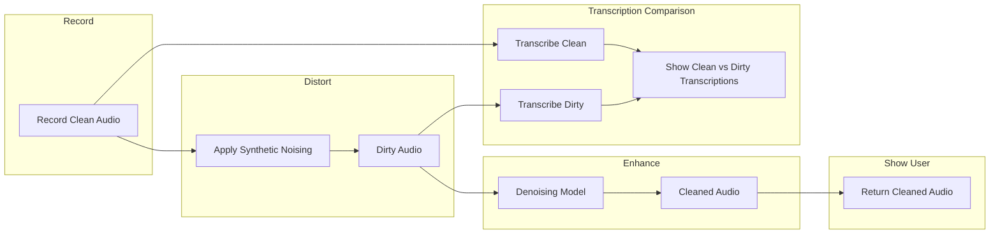
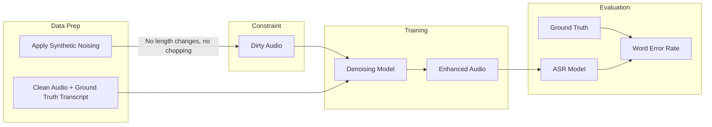

# Relay Walkie-Talkie Audio Denoising — Planning Document

## Project Context

**Event:** Relay ML Engineering onsite interview  
**Date:** Monday, March 9, 2026, 2:00 PM ET  
**Location:** Raleigh, NC  
**Company:** Relay (relaypro.com) — communication platform for frontline teams (hospitality, manufacturing, healthcare) with walkie-talkie-style devices

---

## Business Relevance

- **SOAR Platform:** Processes 1B+ data points/week
- **Voice as enterprise data:** Microphone → codec → cellular radio (VoLTE/VoNR) → network → decompression
- **Degradation at each layer** degrades audio quality
- **Value of denoising:** Better transcription, real-time translation, searchability across the platform

---

## Data Flows

### Inference / Demo Flow




1. Record clean audio (or use a sample)
2. Apply synthetic distortions → dirty audio
3. Pass dirty audio through the model → cleaned audio (return to user)
4. Transcribe both clean and dirty audio → display both transcriptions to show the difference (demonstrates denoising value)

---

### Training Flow




1. Start with clean audio + ground truth transcriptions
2. Apply synthetic distortions to create dirty audio — **with constraint:** no modifications that make transcription inaccurate (e.g., no changing audio length, no chopping/removing segments)
3. Train model (PyTorch) to map dirty → clean
4. Evaluate with **Word Error Rate (WER)** on transcriptions of enhanced audio vs. ground truth

---

### Evaluation: Word Error Rate (WER)

- **Definition:** Percentage of errors relative to human ground truth
- **Error types covered:** Deletions, substitutions, insertions
- **Interpretation:** When WER = 0, semantic meaning is preserved
- **Future consideration (file for later):** Different word errors may have different semantic impact — e.g., substituting "hospital" for "hotel" may be worse than a minor typo. WER treats all errors equally; semantic-weighted metrics could be explored.

---

## Synthetic Noising Pipeline: Cellular Radio

**Relay uses cellular radio (VoLTE/VoNR), not analog walkie-talkies.** The pipeline must simulate cellular voice stack degradations: codecs (AMR, AMR-WB, EVS), narrowband channel, packet loss, and environmental noise.

Apply stochastically (random subset, random intensity) during training.

**Training constraint:** Exclude or parameterize transforms so they do **not** change audio length or chop/remove segments — otherwise ground-truth transcriptions no longer align and WER evaluation becomes invalid.

### Cellular-Specific Transforms


| Transform                          | Purpose                                                                                                        | Length-preserving?        |
| ---------------------------------- | -------------------------------------------------------------------------------------------------------------- | ------------------------- |
| **Bandpass (300Hz–3.4kHz)**        | AMR-NB narrowband telephony bandwidth (per 3GPP)                                                               | Yes                       |
| **Resample to 8kHz**               | AMR-NB sample rate; resample back to original SR for alignment                                                 | Yes (if we resample back) |
| **Real codec round-trip (AMR-NB)** | Authentic CELP quantization, codec artifacts. FFmpeg: 4.75–12.2 kbps. Lower bitrate under simulated poor RF.   | Yes                       |
| **Packet loss simulation**         | LTE packet loss: replace dropped frames with PLC (repeat previous frame or comfort noise), not actual deletion | Yes                       |
| **Background environmental noise** | Mic picks up ambient (warehouse, hospital, kitchen). White/pink noise, varying SNR                             | Yes (additive)            |
| **Bitrate adaptation**             | Simulate poor RF: randomly use 4.75 kbps vs 12.2 kbps to mimic network switching                               | Yes (codec handles it)    |


### Rationale

- **AMR-NB:** 300–3400 Hz, 8 kHz, 4.75–12.2 kbps — widely deployed in 2G/3G/4G. Relay devices likely traverse this or similar narrowband codecs.
- **Packet loss:** VoLTE quality degrades with packet loss; EVS/AMR-WB have PLC but artifacts remain. Simulate by frame-wise replacement (length preserved).
- **Real codec:** Use FFmpeg `libopencore_amrnb` for encode→decode round-trip to get authentic CELP artifacts, not just generic quantization.

**Implementation note:** Run FFmpeg as subprocess (e.g. via `pydub` or `subprocess`) for codec round-trip. Alternative: `audio_degrader` or `audio-degradation-toolbox` for some transforms; FFmpeg for codec authenticity.

---

## Data Sources

**Catalog:** [https://github.com/jim-schwoebel/voice_datasets](https://github.com/jim-schwoebel/voice_datasets)

Recommended clean datasets:

- **LibriSpeech** — read audiobooks, good quality
- **Common Voice (Mozilla)** — crowdsourced, diverse
- **VCTK** — multi-speaker, British English

Transcriptions **required** for: (1) WER evaluation during training (ground truth), and (2) demo transcription comparison (clean vs. dirty).

---

## Requirements (Must-Have)

- **Framework:** PyTorch (per JD)
- **Codec simulation:** FFmpeg with libopencore-amr (AMR-NB) for authentic cellular codec artifacts
- **Deployable demo:** Live demo at interview — feed in audio, show/hear enhancement
- **Spectrogram visualizations:** Clean vs. noisy vs. enhanced
- **Audio playback:** Before/after samples
- **Clean codebase:** Readable, well-structured (code is part of demo)
- **Trainable in hours:** Model small enough for limited hardware/time

---

## Key Talking Points for Interview

- **Product relevance:** Better voice quality improves all downstream tasks (transcription, translation, search)
- **Cellular-specific pipeline:** Tailored to Relay's stack (VoLTE/VoNR, AMR codecs, packet loss) — not generic walkie-talkie noise
- **Practical ML:** Synthetic data generation with real codec round-trip (FFmpeg AMR) for authentic artifacts
- **Production:** Model size vs. latency, quantization for edge, distribution shift monitoring
- **Extensibility:** Different noise profiles per device, environment adaptation (hospital vs. warehouse), fine-tuning on real Relay audio

---

## Suggested Implementation Structure

```
relay-walkie-denoising/
├── README.md
├── requirements.txt
├── config/
│   └── defaults.yaml
├── data/
│   ├── download_datasets.py
│   ├── synthetic_noise.py       # Cellular pipeline: bandpass, AMR codec, packet loss, etc.
│   └── dataset.py               # PyTorch Dataset with paired clean/noisy
├── models/
│   ├── denoiser.py              # U-Net or small FCN for spectrogram enhancement
│   └── losses.py
├── eval/
│   ├── wer.py                   # Word Error Rate computation
│   └── asr.py                   # ASR model for transcription (training + demo)
├── train.py
├── inference.py                 # Load checkpoint, process audio file
├── demo/                        # Demo application
│   ├── app.py                   # Streamlit or Gradio
│   ├── spectrogram_viz.py
│   ├── audio_player.py          # Before/after playback
│   └── transcription.py         # ASR for clean vs. dirty comparison
└── scripts/
    └── demo_sample_audio.py     # Generate demo samples
```

---

## Model Considerations

- **Input/output:** Time-domain or mel-spectrogram domain (spectrogram common for denoising)
- **Architecture:** Small U-Net or SE-ConvTasNet variant — small enough to train in hours
- **Inference latency:** Single GPU or CPU for demo; discuss quantization/ONNX for edge

---

## Future Considerations (Backlog)

- **Semantic impact of word errors:** WER treats all errors equally. In practice, substituting "hospital" for "hotel" may have worse downstream impact than a minor typo. Consider semantic-weighted or task-specific error metrics for production.

---

## Next Steps (Post-Plan Approval)

1. Scaffold project structure and dependencies
2. Implement cellular noising pipeline: bandpass 300–3.4kHz, FFmpeg AMR round-trip, packet loss (PLC-style), environmental noise; all length-preserving
3. Implement PyTorch Dataset and data loader (paired clean/dirty + transcripts)
4. Implement denoising model + WER evaluation (ASR + ground truth)
5. Train model
6. Build demo app: spectrograms, audio playback, clean vs. dirty transcription comparison
7. Add sample scripts and README

