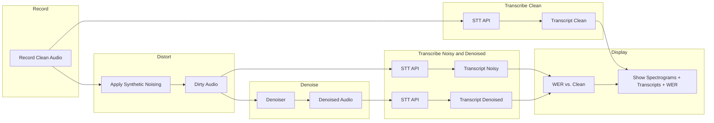
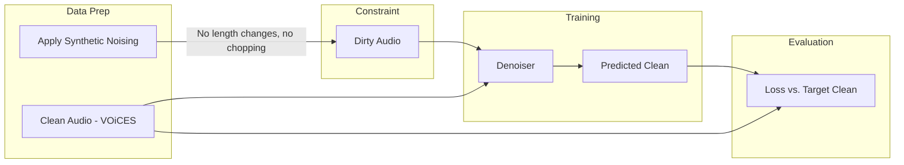

# Relay Walkie-Talkie Denoiser — Planning Document

## Scope

**In-scope:** Implement a denoiser that takes dirty (noisy, cellular-degraded) audio and outputs clean audio. Train on VOiCES (small U-Net, spectrogram domain). Demo: spectrograms (clean, noisy, denoised), transcripts (clean, noisy, denoised), and WER (noisy vs. clean, denoised vs. clean) via external STT API; before/after playback.

**Out-of-scope:** Building or training STT. We consume an STT API (e.g. Whisper API, AssemblyAI, Deepgram) for transcription — used only to complete the demo dataflow (showing that cleaner audio → better transcription). No modification to STT in this application.

## Project Context

**Event:** Relay ML Engineering onsite interview  
**Date:** Monday, March 9, 2026, 2:00 PM ET  
**Location:** Raleigh, NC  
**Company:** Relay (relaypro.com) — communication platform for frontline teams (hospitality, manufacturing, healthcare) with walkie-talkie-style devices

---

## Business Relevance

- **SOAR Platform:** Processes 1B+ data points/week
- **Voice as enterprise data:** Microphone → codec → cellular radio (VoLTE/VoNR) → network → decompression
- **Degradation at each layer** degrades audio quality
- **Value of denoising:** Better transcription, real-time translation, searchability across the platform

---

## Data Flows

### Inference / Demo Flow




1. Record clean audio (or use a sample)
2. **Transcribe clean audio** (before noising) → reference transcript
3. Apply synthetic distortions → dirty audio
4. Pass dirty audio through the **denoiser** → denoised audio
5. Transcribe noisy and denoised audio via STT API
6. **Display:** spectrograms (clean, noisy, denoised), transcripts (clean, noisy, denoised), and WER (noisy vs. clean, denoised vs. clean)

---

### Training Flow




1. Start with clean audio from VOiCES
2. Apply synthetic distortions to create dirty audio — **constraint:** length-preserving (no chopping, no segment removal)
3. Train denoiser (PyTorch, small U-Net) to map dirty → clean
4. Evaluate with reconstruction loss (MSE, L1, or SI-SDR) against target clean

---

## Synthetic Noising Pipeline: Cellular Radio

**Relay uses cellular radio (VoLTE/VoNR), not analog walkie-talkies.** The pipeline must simulate cellular voice stack degradations: codecs (AMR, AMR-WB, EVS), narrowband channel, packet loss, and environmental noise.

Apply stochastically (random subset, random intensity) during training.

**Training constraint:** Exclude or parameterize transforms so they do **not** change audio length or chop/remove segments — otherwise clean/noisy pairs become misaligned and training targets are invalid.

### Cellular-Specific Transforms


| Transform                          | Purpose                                                                                                        | Length-preserving?        |
| ---------------------------------- | -------------------------------------------------------------------------------------------------------------- | ------------------------- |
| **Bandpass (300Hz–3.4kHz)**        | AMR-NB narrowband telephony bandwidth (per 3GPP)                                                               | Yes                       |
| **Resample to 8kHz**               | AMR-NB sample rate; resample back to original SR for alignment                                                 | Yes (if we resample back) |
| **Real codec round-trip (AMR-NB)** | Authentic CELP quantization, codec artifacts. FFmpeg: 4.75–12.2 kbps. Lower bitrate under simulated poor RF.   | Yes                       |
| **Packet loss simulation**         | LTE packet loss: replace dropped frames with PLC (repeat previous frame or comfort noise), not actual deletion | Yes                       |
| **Background environmental noise** | Mic picks up ambient (warehouse, hospital, kitchen). White/pink noise, varying SNR                             | Yes (additive)            |
| **Bitrate adaptation**             | Simulate poor RF: randomly use 4.75 kbps vs 12.2 kbps to mimic network switching                               | Yes (codec handles it)    |


### Rationale

- **AMR-NB:** 300–3400 Hz, 8 kHz, 4.75–12.2 kbps — widely deployed in 2G/3G/4G. Relay devices likely traverse this or similar narrowband codecs.
- **Packet loss:** VoLTE quality degrades with packet loss; EVS/AMR-WB have PLC but artifacts remain. Simulate by frame-wise replacement (length preserved).
- **Real codec:** Use FFmpeg `libopencore_amrnb` for encode→decode round-trip to get authentic CELP artifacts, not just generic quantization.

**Implementation note:** Run FFmpeg as subprocess (e.g. via `pydub` or `subprocess`) for codec round-trip. Alternative: `audio_degrader` or `audio-degradation-toolbox` for some transforms; FFmpeg for codec authenticity.

---

## Data Sources

**Dataset: VOiCES only** — [Voices Obscured in Complex Environmental Settings](https://iqtlabs.github.io/voices/downloads/)

- **Download:** Publicly available on AWS S3 bucket `lab41openaudiocorpus`; use AWS CLI (e.g. `aws s3 cp s3://lab41openaudiocorpus/VOiCES_devkit.tar.gz .` or full release)
- **Content:** Creative Commons speech corpus targeting acoustically challenging and reverberant environments
- **Labels:** Robust truth data for denoising (paired clean/noisy) and optionally transcription — we use clean audio as training targets; transcripts not required for training

For demo transcription comparison: use an external STT API (e.g. Whisper API, Deepgram, AssemblyAI) on noisy vs. cleaned audio.

---

## Requirements (Must-Have)

- **Framework:** PyTorch (per JD)
- **Codec simulation:** FFmpeg with libopencore-amr (AMR-NB) for authentic cellular codec artifacts
- **Deployable demo:** Live demo at interview — feed in audio, show/hear denoised output
- **Spectrogram visualizations:** Clean vs. noisy vs. denoised
- **Audio playback:** Before/after samples
- **STT for demo:** Consume external STT API for clean (before noising), noisy, and denoised transcripts; compute and display WER
- **Clean codebase:** Readable, well-structured (code is part of demo)
- **Trainable in hours:** Small U-Net; limited params for fast training

---

## Key Talking Points for Interview

- **Scope:** Denoiser only — wrangle clean from dirty audio. STT consumed via external API, not built or modified here
- **Product relevance:** Better voice quality improves downstream tasks (transcription, translation, search) — demo shows cleaner audio → better STT output
- **Cellular-specific pipeline:** Tailored to Relay's stack (VoLTE/VoNR, AMR codecs, packet loss) — not generic walkie-talkie noise
- **Practical ML:** Synthetic data generation with real codec round-trip (FFmpeg AMR) for authentic artifacts; small U-Net for tractable training
- **Production:** Model size vs. latency, quantization for edge, distribution shift monitoring
- **Extensibility:** Different noise profiles per device, environment adaptation; fine-tuning on real Relay audio

---

## Suggested Implementation Structure

```
relay-walkie-denoising/
├── README.md
├── requirements.txt
├── config/
│   └── defaults.yaml
├── data/
│   ├── download_voices.py       # Download VOiCES from S3
│   ├── synthetic_noise.py       # Cellular pipeline: bandpass, AMR codec, packet loss, etc.
│   └── dataset.py               # PyTorch Dataset with paired clean/noisy
├── models/
│   ├── denoiser.py              # U-Net on spectrograms
│   └── losses.py
├── train.py
├── inference.py                 # Load checkpoint, process audio file
├── demo/                        # Demo application
│   ├── app.py                   # Streamlit or Gradio
│   ├── spectrogram_viz.py
│   ├── audio_player.py          # Before/after playback
│   └── stt_client.py            # Call STT API; transcribe clean, noisy, denoised; compute WER
└── scripts/
    └── demo_sample_audio.py     # Generate demo samples
```

---

## Model Considerations

- **Target:** Small denoiser — priority on fewer params for easier training; accuracy sufficient to show denoising improves output
- **LoRA (optional):** Parameter-efficient fine-tuning if using a pretrained base; for a small U-Net from scratch, full training is fine
- **Inference latency:** Single GPU or CPU for demo; discuss quantization/ONNX for edge

---

## Building the Denoiser

### Domain

- **Spectrogram (recommended):** Input mel or STFT spectrogram of noisy audio → output spectrogram of clean audio → invert with overlap-add to waveform. Well-suited for denoising; standard approach.
- **Waveform (alternative):** End-to-end time-domain (e.g. ConvTasNet) — no STFT, but typically needs more data/params. Skip for this scope.

### Architecture: Small U-Net

```
Input: noisy spectrogram [B, 1, F, T]  (single channel, F freq bins, T time frames)
       ↓
Encoder: 3–4 stages of Conv2d + BatchNorm + ReLU + MaxPool
         Each stage halves H,W; doubles channels (e.g. 32 → 64 → 128 → 256)
       ↓
Bottleneck: Conv blocks, no downsampling
       ↓
Decoder: 3–4 stages of UpConv + skip from encoder + Conv2d + BatchNorm + ReLU
         Each stage doubles H,W; halves channels
       ↓
Output: clean spectrogram [B, 1, F, T]  (same shape as input)
```

**Design choices:**

| Component | Choice |
|-----------|--------|
| **Encoder/decoder depth** | 3–4 levels; keep shallow for small param count |
| **Base channels** | 32 or 64; scale up per stage |
| **Skip connections** | Concatenate encoder features with decoder (standard U-Net) |
| **Output activation** | None or ReLU (spectrograms ≥ 0); or sigmoid if normalizing to [0,1] |

### Data flow

1. **Preprocess:** Waveform → STFT or mel → log-magnitude (optional) → normalize
2. **Model:** `pred_clean_spec = denoiser(noisy_spec)`
3. **Postprocess:** Combine predicted magnitude with noisy phase (or predicted phase if model outputs complex) → inverse STFT → waveform

### Loss

- **MSE** or **L1** on spectrogram: `loss = criterion(pred_clean_spec, target_clean_spec)`
- Alternative: **SI-SDR** on waveform (requires inverse STFT in training loop)

### Training

- Standard loop: forward, loss, backward, optimizer step
- Adam/AdamW; learning rate ~1e-3 with decay
- Batch size: as large as memory allows; spectrograms are relatively compact

### Implementation outline

1. **`Denoiser` class** — `nn.Module` with encoder blocks, bottleneck, decoder blocks, skip connections
2. **`EncoderBlock`** — Conv2d → BN → ReLU → MaxPool; return pre-pool features for skip
3. **`DecoderBlock`** — Upsample → concat skip → Conv2d → BN → ReLU
4. **`SpectrogramTransform`** — waveform ↔ spectrogram (torchaudio `Spectrogram`, `InverseSpectrogram` or custom STFT)
5. **`DenoisePipeline`** — wraps: waveform → spec → model → spec → waveform for inference

---

## Future Considerations (Backlog)

- **Non-ML denoising (sidenote):** Explore whether traditional audio processing (spectral subtraction, Wiener filtering, RNNoise-style DSP+small DNN) can achieve comparable denoising without a larger ML model. Helps justify when ML is worth the added cost. Pure DSP often struggles with codec artifacts and complex/reverberant noise; hybrid approaches may be a useful baseline.

---

## Next Steps (Post-Plan Approval)

1. Scaffold project structure and dependencies
2. Download VOiCES; implement cellular noising pipeline (bandpass 300–3.4kHz, FFmpeg AMR round-trip, packet loss, environmental noise); all length-preserving
3. Implement PyTorch Dataset and data loader (paired clean/dirty)
4. Implement denoiser (U-Net); train with reconstruction loss (MSE or L1 on spectrogram)
5. Build demo app: spectrograms, audio playback, transcripts (clean/noisy/denoised), WER (noisy vs. clean, denoised vs. clean) via STT API
6. Add sample scripts and README

